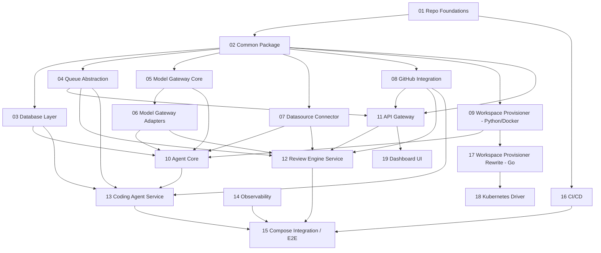

# Implementation Specs — Index

This directory breaks the design in [`oss-engine-architecture.md`](../oss-engine-architecture.md)
and [`oss-tech-stack.md`](../oss-tech-stack.md) into small, independently
implementable specs. Each spec is scoped to roughly one package or one
service capability, follows test-driven development, and ends with a
checklist of acceptance criteria that must be true (and demonstrated by
passing tests) before the spec is considered done.

## Conventions used in every spec

- **Status**: `Not Started` / `In Progress` / `Done`. Update as work lands.
- **Depends on**: specs that must be `Done` (interfaces stable) before this
  one can start. Implementation may still stub dependencies behind fakes
  early, but the acceptance criteria require the real dependency.
- **Owns**: the exact package/service directory this spec is responsible
  for. No other spec should modify files under this path.
- **TDD Plan**: the order in which tests are written. Tests are written
  *before* the corresponding implementation code, per test. A spec is not
  "started" correctly if implementation exists before its test.
- **Acceptance Criteria**: a checklist. Every item must be verifiable —
  either by a named test (unit/integration) or an explicit manual check
  (e.g. `docker compose up` succeeds). Prefer automated checks.

## Build order / dependency graph

Phase 1 (Python core system) is built bottom-up: shared libraries first,
then services that consume them, then the services are wired together in
Compose. Phase 2 (Go provisioner) and Phase 3 (dashboard) only start once
Phase 1's contracts are proven.

`14 Observability` is cross-cutting: the base (structured logging,
tracing setup in `common`) lands as part of spec 02, but instrumentation
of the agent loop and services is only fully validated once those
services exist (spec 14 revisits and adds the dashboards/exporters).

## Phase summary

| Phase | Specs | Corresponds to |
|---|---|---|
| Phase 1 — Core system (Python) | 01–16 | tech-stack Phase 1 |
| Phase 2 — Provisioner rewrite (Go) | 17–18 | tech-stack Phase 2 |
| Phase 3 — Optional dashboard | 19 | tech-stack Phase 3 |

## Cross-cutting rules that apply to every spec

1. **No hardcoded provider/infra assumptions.** Anything provider- or
   infra-specific must sit behind an interface defined in the owning
   spec, configured via `common`'s config loader (spec 02).
2. **Every package is independently testable.** Unit tests must not
   require Docker, a live DB, or network access. Integration tests that
   do are marked and isolated (see spec 01 for the `pytest` marker
   scheme).
3. **Interfaces are written and reviewed before implementations.** For
   specs that define a `Protocol`/ABC (Model Gateway, Datasource
   Connector, Workspace Provisioner), the interface + its contract test
   suite ships as its own first commit, separate from any adapter.
4. **A shared contract test suite backs every pluggable interface.** Each
   adapter/driver for a given interface (e.g. every `ModelProvider`
   adapter, every `WorkspaceDriver`) must pass the same abstract contract
   test suite, parametrized over the adapter, so drivers can't silently
   diverge in behavior.

## File list

- [01-repo-foundations.md](01-repo-foundations.md)
- [02-common-package.md](02-common-package.md)
- [03-database-layer.md](03-database-layer.md)
- [04-queue-abstraction.md](04-queue-abstraction.md)
- [05-model-gateway-core.md](05-model-gateway-core.md)
- [06-model-gateway-adapters.md](06-model-gateway-adapters.md)
- [07-datasource-connector.md](07-datasource-connector.md)
- [08-github-integration.md](08-github-integration.md)
- [09-workspace-provisioner-python.md](09-workspace-provisioner-python.md)
- [10-agent-core.md](10-agent-core.md)
- [11-api-gateway.md](11-api-gateway.md)
- [12-review-engine.md](12-review-engine.md)
- [13-coding-agent.md](13-coding-agent.md)
- [14-observability.md](14-observability.md)
- [15-compose-integration-e2e.md](15-compose-integration-e2e.md)
- [16-ci-cd.md](16-ci-cd.md)
- [17-workspace-provisioner-go.md](17-workspace-provisioner-go.md)
- [18-k8s-driver.md](18-k8s-driver.md)
- [19-dashboard-ui.md](19-dashboard-ui.md)
